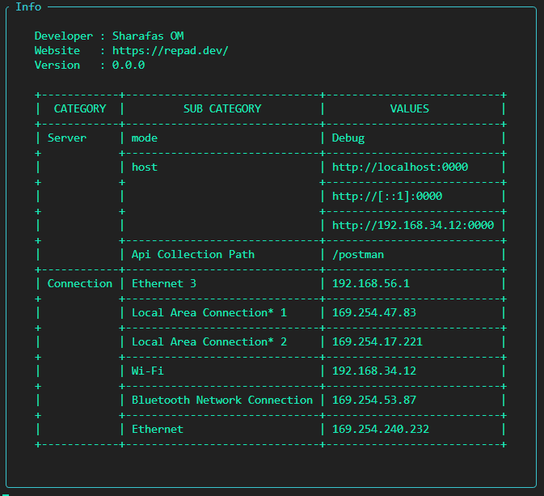

[](https://pkg.go.dev/github.com/Essentialutils/go_custom_utils?tab=doc)
[](https://github.com/Essentialutils/go_custom_utils/releases)

## Import

```go
import (
    gcu "github.com/Essentialutils/go_custom_utils"
)
```

## Print Server Details

```go
gcu.InfoPrint(gcu.InfoPrintData{
    ServerRunningPort: ":0000",
    ServerRunningMode: "Debug",
    OpenApiPath:       "/postman",
    Developer:         "Sharafas OM",
    Website:           "https://repad.dev/",
    Version:           "0.0.0",
})
```
output : 


